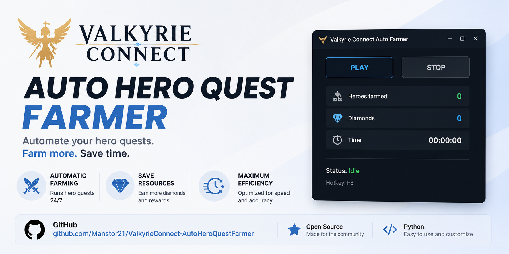

# Valkyrie Connect - Auto Hero Quest Farmer

**Version 1.0.0**

[](LICENSE)
[](https://www.python.org/)
[](https://opencv.org/)
[](https://numpy.org/)
[](https://pyautogui.readthedocs.io/)
[](https://docs.python.org/3/library/tkinter.html)

<p align="center">
  
</p>

Image-recognition automation for **Hero Quests** in Valkyrie Connect (desktop version). The bot navigates the hero selection menu, clears each hero's node route (story scenes + battles), and claims the final reward chests automatically. No memory access or game modification of any kind — everything is driven purely by what's on screen.

> **⚠️ Important notice**
> This tool automates mouse and keyboard actions on top of the game window. Use it entirely at your own risk. I'm not responsible for any penalty, ban, or other consequence that may result from using it. Respect the game's terms of service.

> **⚠️ Limitations**
> This isn't a flawless tool. Image recognition depends on the quality of your captured templates, your screen resolution, and in-game conditions. It can occasionally fail — a button not detected, a scroll that lands slightly off, a chest that doesn't open. It generally does its job, but if it gets stuck, hit F8 and adjust. Don't expect miracles.

---

## Table of contents

- [Features](#features)
- [Requirements](#requirements)
- [Installation](#installation)
- [Prepare your templates](#prepare-your-templates)
- [Usage](#usage)
- [How to stop it](#how-to-stop-it)
- [How it works](#how-it-works)
- [Configuration](#configuration)
- [Known issues / troubleshooting](#known-issues--troubleshooting)
- [Project structure](#project-structure)
- [License](#license)

## Features

- Fully automated hero quest farming: story nodes, battles, and chest claiming.
- No fixed pixel coordinates — everything is located live via template matching.
- Handles imprecise in-game scrolling by dynamically searching for each card's real position.
- Skips already-completed heroes (star badge **and** pending-node check, since story scenes don't award stars).
- Duplicate-hero protection after scrolling via perceptual hashing (no OCR/Tesseract required).
- Optional Tkinter GUI with live stats (heroes farmed, estimated diamonds, elapsed time).
- Global stop hotkey (F8) that works even while the game window has focus.


## Requirements

- Python 3.9 or later
- Valkyrie Connect running in windowed mode (not fullscreen)
- Template images included in the repository.

## Installation

```bash
pip install -r requirements.txt
```

On Windows, if you want the **F8** stop hotkey to work while the game has focus, run your terminal **as Administrator**. This gives the script the same privilege level as the game, which Windows requires for keyboard hooks to work across processes (UIPI restriction).

## Prepare your templates

The bot is entirely image-driven. You need to capture your own reference images from your game session and place them in a `templates/` folder. Each crop should be tight, with no extra background:

| File | What to capture |
|---|---|
| `icono_disponible.png` | The orange circle with "!" marking a pending node |
| `boton_omitir.png` | The "Skip" button in story scenes |
| `boton_aceptar_omitir.png` | The confirmation prompt after pressing Skip |
| `boton_play.png` / `boton_play_v2.png` | The Play button (team prep and selection screens) |
| `pantalla_resultados.png` | The victory screen (wings + stars) |
| `cofre_1.png` / `cofre_2.png` / `cofre_3.png` | The three final chests (wood, silver, gold) |
| `flecha_volver.png` | The back arrow to return to the hero list |
| `insignia_completa.png` | The full gold "★ 9/9" completed-hero badge |

## Usage

### With the GUI

```bash
python interfaz_valkyrie.py
```

1. Open the hero selection menu in-game.
2. Press **PLAY** in the interface.
3. You have 5 seconds to switch focus to the game window.
4. The bot starts farming heroes automatically.

### Console only

```bash
python recorrido_heroes.py
```

### Single quest (test run)

```bash
python auto_farmeo_valkyrie.py
```

Clears whichever hero's route is currently open on screen and claims its chests. No navigation between heroes.

## How to stop it

- The **STOP** button in the GUI.
- The **F8** key (global — works even while the game has focus).
- Move the mouse to the **top-left corner** of the screen (pyautogui fail-safe).

## How it works

No fixed coordinates, no game memory access. Everything is derived from what's visible on screen:

- **Node and button recognition**: your captured templates are matched live against the screen using OpenCV. This is how it finds the Play button, chests, pending nodes, and so on.
- **Hero navigation**: the selection grid is walked using coordinates relative to your screen resolution. Since in-game scrolling doesn't always land in exactly the same spot, the bot searches for each card's real position by scanning up/down until it finds legible text.
- **Scrolling**: performed as a drag/swipe instead of mouse-wheel scrolling, because the game handles wheel events poorly.
- **Duplicate-hero avoidance**: after scrolling, some cards may reappear. The bot identifies them by a perceptual hash of the name area (not OCR). If two hashes are close enough, it assumes it's the same hero and skips it.
- **Completion detection**: looks for the "★ 9/9" badge via template matching, and additionally checks for any remaining "!" nodes — since story scenes don't award stars, a hero can show 9/9 while still having unseen scenes.

## Configuration

A few constants you'll likely want to tune for your own setup (all in `recorrido_heroes.py` unless noted):

| Constant | Default | Purpose |
|---|---|---|
| `GRID_COLS_X` / `GRID_ROWS_Y` | measured for 1920x1080 | Relative grid positions of hero cards on the selection screen |
| `NAME_OFFSET` | `(-126, -60, 400, 36)` | Pixel offset/size of the hero name text box, relative to card center |
| `scroll_distance` | `550` | Swipe distance (px) used to scroll the hero list |
| `CONFIDENCE_BADGE` (in `auto_farmeo_valkyrie.py`) | `0.65` | Match confidence for the pending-node "!" icon |
| `STOP_KEY` (in `interfaz_valkyrie.py`) | `"f8"` | Global stop hotkey |

If your screen resolution isn't 1920x1080, re-measure `GRID_COLS_X`, `GRID_ROWS_Y`, and `NAME_OFFSET` from your own screenshot before running.

## Known issues / troubleshooting

- **F8 doesn't stop the bot while the game has focus** → likely a Windows UIPI privilege mismatch. Run the terminal as Administrator (same privilege level as the game).
- **Chest-closing click lands in the wrong place** → the animation-skip click position is hardcoded (`w // 2 + 220`); adjust the offset in `claim_chests()` in `auto_farmeo_valkyrie.py` to match your resolution.
- **A UI icon gets misidentified as a pending node** → exclude that screen region from the search (see the `region` parameter added to `find_all_on_screen`), or capture a tighter/higher-confidence template.
- **A hero card is skipped or repeated after scrolling** → the scroll distance and/or `NAME_OFFSET` likely need recalibrating for your resolution/window size.
- **`ModuleNotFoundError: auto_farmeo_valkyrie`** → all `.py` files must live in the same folder; make sure you're not running a copy from a different directory.

## Project structure

```
.
├── auto_farmeo_valkyrie.py   # Core logic: nodes, battles, chests
├── recorrido_heroes.py       # Hero selection grid navigation
├── interfaz_valkyrie.py      # Tkinter GUI
├── requirements.txt
├── gui_templates/            # Decorative icons for the GUI
└── templates/                # Your own reference captures
```

## License

MIT License — see [LICENSE](LICENSE).
